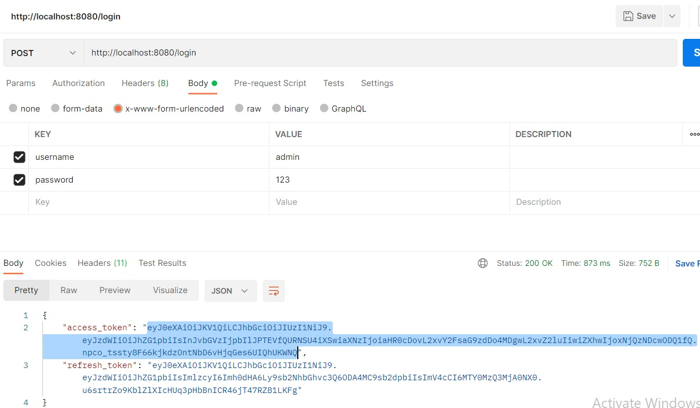
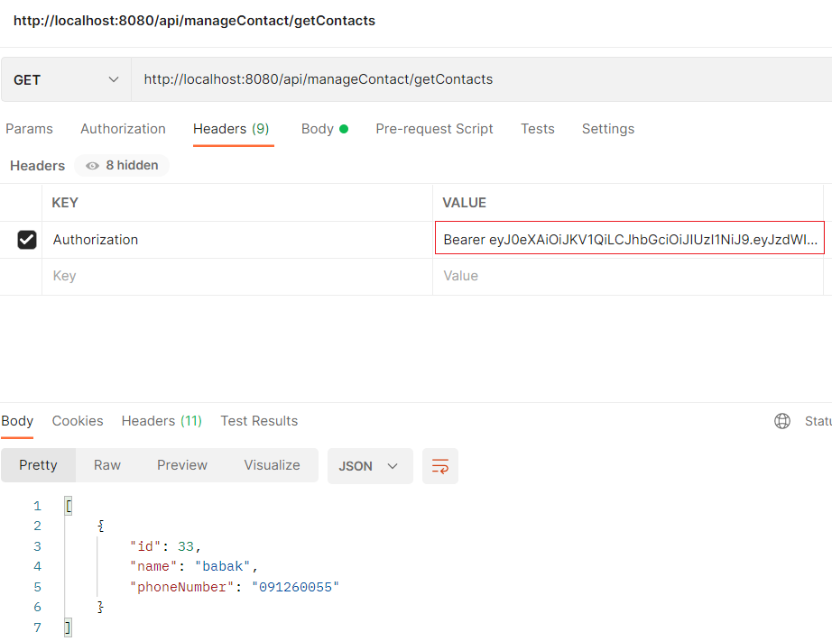

# spring-boot-bearer-authentication

## About this project

This Spring Boot project shows an phonebook project with Spring Security that ensures only
authenticated users can call endpoints available api.
### Default credentials

* username: `admin`
* password: `123`

## Getting started
* first step is calling login api and get access-token for use in header of  others apis(http://localhost:8080/login)

****

### APIs:
##### manage User :
* http://localhost:8080/api/manageUser/getUsers
* http://localhost:8080/api/manageUser/saveUser
* http://localhost:8080/api/manageUser/saveRole
* http://localhost:8080/api/manageUser/addRoleToUser
* http://localhost:8080/api/manageUser/token/refresh
##### manage Contact :
* http://localhost:8080/api/manageContact/addContact
* http://localhost:8080/api/manageContact/getContacts
* http://localhost:8080/api/manageContact/getContact
* http://localhost:8080/api/manageContact/updateContact/{contactId}
* http://localhost:8080/api/manageContact/removeContact/{contactId}

## Features

* Spring Security
* Bearer Authentication
* H2 Database

## Built With

* [Spring Boot v2.5+](https://spring.io/projects/spring-boot)
* [Maven](https://maven.apache.org/)
* Java version 11

